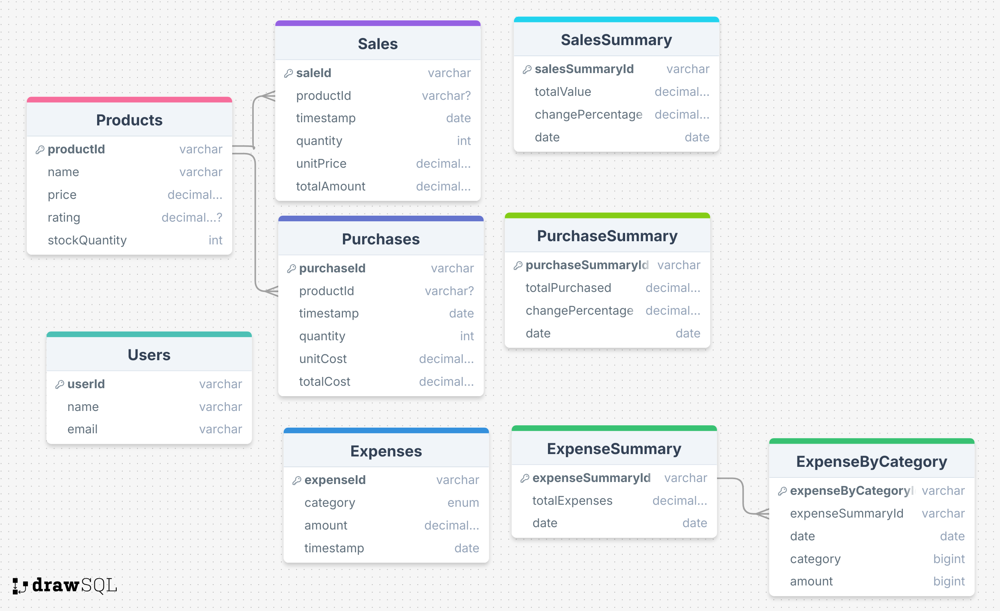

# Inventory Management Dashboard

## 📌 Project Purpose

This project is a complete full stack inventory management dashboard built with **Next.js**, **Redux**, **Node.js**, and **AWS**. It is designed to help developers learn how to integrate scalable, production-grade technologies across the entire stack.

## 🛠️ Tech Stack

### Frontend

- **Next.js**: Framework for building React applications
- **Tailwind CSS**: Utility-first CSS framework for styling
- **Material UI Data Grid**: For advanced data table features
- **Redux Toolkit**: Simplified state management
- **Redux Toolkit Query**: For data fetching

### Backend

- **Node.js** with **Express.js**
- **Prisma**: ORM used to manage PostgreSQL database interactions

### AWS Services
#### RDS
- **RDS**: For PostgreSQL database hosting

#### EC2
- **EC2**: To host the Node.js backend server

##### API Gateway
- **API Gateway**: To create and manage APIs
##### S3
- **S3**: For storing images and assets
##### Amplify
- **Amplify**: For deploying the frontend
#### Final AWS Architecture

## 🧩 Features

- Fully responsive dashboard layout
- Dark mode and light mode support
- Product CRUD operations
- Expense tracking with filtering by category and date
- Dynamic charts with Recharts
- User and settings management

## 📦 Installation

Ensure you have Node.js and npm installed. Then follow these steps:

```bash
# Clone the repository
git clone https://github.com/your-username/inventory-management.git

# Navigate to client
cd inventory-management/client

# Install dependencies
npm install

# Run the development server
npm run dev
```

You’ll also need to set up the backend and AWS services as outlined in the video tutorial.

## 🚀 Usage

Visit the live demo here: [Live Demo Link](https://main.d1yhhw9mo24p21.amplifyapp.com/)

## 👤 Author

Developed by **Timothy Chelelgo**


## 🖥️ EC2 Setup Instructions

### 1. Connect to EC2 Instance via EC2 Instance Connect

### 2. Install Node Version Manager (nvm) and Node.js

```bash
# Switch to superuser and install nvm
sudo su -
curl -o- https://raw.githubusercontent.com/nvm-sh/nvm/v0.39.7/install.sh | bash

# Activate nvm
. ~/.nvm/nvm.sh

# Install the latest version of Node.js using nvm
nvm install node

# Verify that Node.js and npm are installed
node -v
npm -v
```

### 3. Install Git

```bash
# Update the system and install Git
sudo yum update -y
sudo yum install git -y

# Check Git version
git --version

# Clone your code repository from GitHub
git clone [your-github-link]

# Navigate to the directory and install packages
cd inventory-management
npm i

# Create .env file and set the PORT
echo "PORT=80" > .env

# Start the application
npm start
```

### 4. Install pm2 (Production Process Manager for Node.js)

```bash
# Install pm2 globally
npm i pm2 -g

# Create a pm2 ecosystem configuration file (inside server directory)
# Example:
module.exports = {
  apps : [{
    name: 'inventory-management',
    script: 'npm',
    args: 'run dev',
    env: {
      NODE_ENV: 'development',
      ENV_VAR1: 'environment-variable',
    }
  }],
};

# Modify the ecosystem file if necessary
nano ecosystem.config.js

# Set pm2 to restart automatically on system reboot
sudo env PATH=$PATH:$(which node) $(which pm2) startup systemd -u $USER --hp $(eval echo ~$USER)

# Start the application using the pm2 ecosystem configuration
pm2 start ecosystem.config.js
```

#### Useful pm2 commands:

```bash
pm2 stop all       # Stop all processes
pm2 delete all     # Delete all processes
pm2 status         # Check status of processes
pm2 monit          # Monitor processes
```
